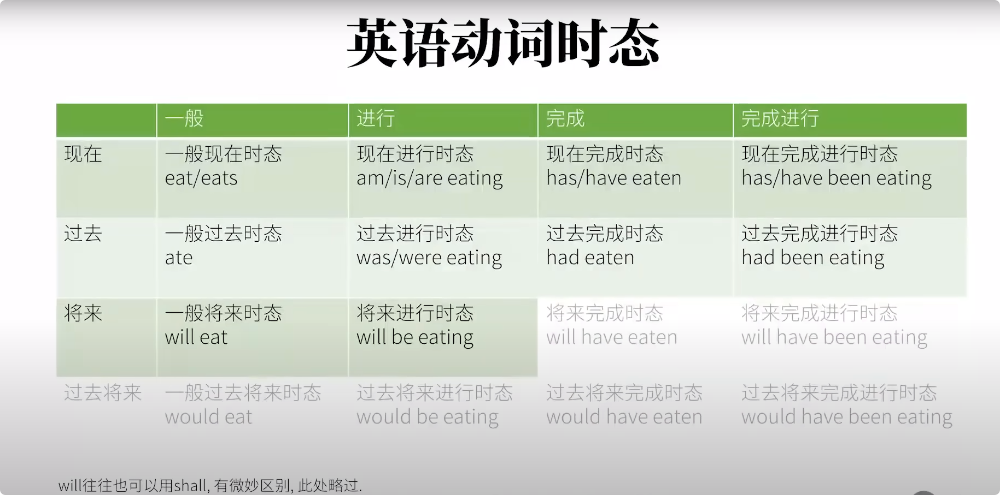

# 时态

[时态组合](../data/image2.png)

本文档先讲清楚所有的动词时间以及所有的动词状态,然后再细看以及举例说明各种不同的时态. 先把事件和状态的概念搞清楚,然后再具体讨论用什么词去构成时态.

## 动词时间

**过去**、**现在**、**将来**、**过去将来** [见图](../data/image5.png)

**过去将来**和**现在**没有必然关系,可能在现在的过去,也可能是现在的将来.也就是说只有**过去将来**中的过去是确定在过去,**过去将来**中的**将来**可能再过去,可能在现在,可能在将来. 现实中不常见,一般只出现在从句中.

## 动词状态

- 进行状态: e.g. 兔子**正在吃**胡萝卜.(兔子这个吃胡萝卜的动作/过程 **正在进行**中)
- 完成状态: e.g. 兔子**吃掉了**胡萝卜.(兔子已经把胡萝卜**吃完了/饱了**, 动作状态**已完成**了),完成状态并不直接说明动作的具体开始时间.
- 完成进行状态: e.g. 兔子**从早上就开始**吃胡萝卜,现在**还没停**呢.(表示动作的一部分完成了,但剩下的还在进行中)
- 一般的状态: 如果把时间的信息去掉,句子中并没有特别指出动作的状态. 即使是过去动作"已经完成"这一信息,也是自己推断出来的. "没有状态信息"这样的状态就是所谓的**一般状态**

**英语动词的时间和状态往往联系得非常非常紧密.拆开的主要目的是易于理解.**

## 时间 + 状态

...

## 时态的四大难点:

1. 时&态未分清 (必须要理解时间和状态是怎么"合体"的).
2. 动词变位(Verb Conjugation). The rabbit **ate** a carrot. 原形 eat --> ate. 这个就是动词的**时态变位**. eat --> eats(吃--第三人称单数)--**人称变位**, 再比如 am, is, are 是动词 be 的现在时间里的人称变位; was,were 是 be 在过去时间里的人称变位.
3. 助动词(Auxiliary Verbs). 不但有时候出现有时候不出现, 而且往往和之后的的实义动词一样也要进行"动词变位",所以又是"难上加难". 以下都是进行状态

   - The rabbit _was_ **eating** a carrot.
   - The rabbit has _been_ **eating** a carrot.
   - The rabbit will _be_ **eating** a carrot.

   这三句里都有助动词 be 的身影,但是因为动词变位(be 变成了 was, been),看上去却不一样,这也很容易引起混乱.

4. 与其他语法概念混合

   - 现在完成时 The rabbit _has_ **eaten** a carrot. + 情态动词 ==> The rabbit **_may_** _has_ **eaten** a carrot. (这兔子可能吃掉了胡萝卜.) + 改时间(情态动词+时间) + 否定 ==> The rabbit **_could not_** _have_ **eaten** a carrot.(这兔子不可能(之前就)吃掉了胡萝卜.) + 改为被动 The carrot **_could not_** _have_ _been_ **eaten** by the rabbit. (这胡萝卜不可能(之前就)被这兔子吃掉了.)

   在这个时态合集里, 为了"孤立"时态的难点,课程暂时不讨论助动词中情态动词这一类,也不讨论被动态等其他语法概念. 那些语法概念留到后面.

## 每种时态构成

### 1. 一般现在时态

构成:

- \+ 动词原形
- \+ 动词原形 + s (第三人称单数)

I **eat** carrots. 我吃胡萝卜.(并未特别指出状态.) 很容易认为是: 我正在吃胡萝卜.
You **eat** carrots.  
We **eat** carrots.  
She **eats** carrots.  
The rabbit **eats** carrots.

该时态是最容易出错的时态之一. 原因是很容易把 "**现在**" 时间和 "**一般**" 状态弄混淆

**一般现在时态**最常见的三种情况:

1. 表达事实.

- I eat carrot**s**. 我吃胡萝: 我是吃胡萝卜这种食物的.(这是个事实陈述.) The rabbit eats carrot**s**.兔子吃胡萝卜: 兔子是吃胡萝卜的动物.(也是事实陈述.) ---- 二句话的 carrots 都用了复数,而且前面没有冠词,这是"泛指"胡萝卜这类食物. 同样的意思如下.
- The sun rises in the east. 太阳从东边升起.
- The earth revolves arround the sun. 地球绕太阳转.
- You like Papa Rabbit. 你喜欢兔子老爹.

这样的"事实"情况,既没有状态限制,也没有时间限制,也就是说和"现在"没有特别大的关系.

2. 表达习惯/重复的动作

> I play basketball. 我打篮球.(我有这个习惯.)

3. 表示预计发生的事

> The bus leaves at 8PM tonight.公车今晚八点离站. (也可以把这句话当做陈述一个事实.也可以再加上个时间,把它改成"习惯/重复的动作", 如 The bus leaves at 8PM **every day**.)

### 2. 现在进行时态

构成: **助动词 be 的变位** + **动词的现在分词**

- **be** 这个动词有两个主要身份:

  1.  (连)系动词

      > I am a smart rabbit --> I = a smart rabbit

  2.  助动词, 构成时态

      - be 的动词变位,也就是改变拼写,为:
        > I **am** ; You/we/they **are**; She/he/it **is**

- 动词的现在分词

  通常: + ing

  > 如:looking(看), smelling(闻), tasking(品尝)...

  有些动词在此基础上改变拼写,如:

  > write -> writing, 不是 writeing; hit -> hitting, 不是 hiting; die -> dying, 不是 dieing

> e.g. I eat a carrots. 改为现在进行时就是:  
> I **am** **eating** carrots. 我正在吃(一些) 胡萝卜. I + be 的变位 + eating + carrots.  
> 更自然一点: I **am** **eating** a carrot. 我正在吃一根胡萝卜.  
> 其他人称:  
> You/we/they are eating carrots.  
> She/he/it is eating carrots.

> The rabbit is eating a carrot. (这兔子现在正在吃胡萝卜的过程中.)  
> You are watching my video. (你现在正在看我的视频的过程中.)  
> I am thinking of you.(我现在处在想你的过程中.)

### 3. 现在完成时态(Present Perfect Tense)

构成: **助动词 have 的变形** + **动词的过去分词**

- have 这个词有二个主要身份:

  1.  实义动词

      > 我有些"硬币"给这个视频. I have some coins for this video.

  2.  助动词,构成时态
      - have 的动词变位,也就是改变拼写,为:
        > I/you/we/they **have**  
        > She/he/it **has**

- **动词的过去分词**(动词的过去分词 ≠ 过去式)

  通常: + ed

  > 如: looked(看), smelled(闻), tasked(品尝)...

  有些动词是"不规则变化", 如:

  > eat -> eaten; (eat, give, see, fall -> eaten, given, seen, fallen)  
  > bring -> brought; (bring, buy, fight, think -> brought, bougth, fought, thought)  
  > feel -> felt; feel, (keep, sleep, leave -> felt, kept, slept, left.)

> e.g. I eat carrots. 改为现在完成时态就是:  
> I **have** **eaten** carrots.我吃过胡萝卜.(言下之意: 我曾吃过胡萝卜.) I + have 的变位 + eaten + carrots.  
> I **have** **eaten** a carrot. 我吃过一根胡萝卜.(我已经吃过,所以不饿.)  
> 其他人称:  
> You/we/they have eaten a carrot.  
> She/he/it has eaten carrot.

> The rabbit has eaten a carrot.(这兔子到现在为止已经吃了胡萝卜.)
> You have watched my video.(你到现在为止已经看过我的视频.)
> I have thought of you .(我到现在已经想过你到了.)

### 4. 现在完成进行时态(Present Perfect Progressive Tense)

构成可以说是进行态 + 完成态的综合:

1. 现在完成时态的构成是: have 的变位 + 动词的过去分词
2. 现在进行时态的构成是: be 的变位 + 动词的现在分词

两者的综合其实就是把 2 中的 be 作为 1 中的动词,也就是说 1 中的"动词"是 be.更进一步说,2 中 b 的变位 = 1 中的 be 的过去分词.  
所以现在完成进行时态的构成: have 的变位 + been + 动词的现在分词.[如图](../data/image6.png)

> e.g. I eat carrots. 改为现在完成进行时态:  
> I + **have 的变位** + **been + eat 的现在分词** + carrots. --> I have been eating carrots. 我在吃胡萝卜.(不但已经吃了些,还将继续.)

> The rabbit _has_ **been eating** a carrot. (这兔子到现在为止*已经*吃胡萝卜一段时间了,还**要再继续吃**一段时间.)  
> You _have_ **been watching** my video.(你到现在为止*已经*看了我视频一段时间了,还要**再继续看**一段时间.)
> I _have_ **been thinking** of you.(我到现在为止*已经*想你一段时间了,还要**继续想**一段时间.)

been 不管在什么人称里都是一样的.

### 过去时间的四种时态其实就是把现在时间的四种时态往前推一段时间而已.

### 5. 一般过去时态

可以把这个"一般"状态想成单纯地指出有个动作发生了而已,至于动作多久?动作何时开始?何时结束?如果没有上下文则不得而知.

构成: + 动词的过去式

e.g. eat(原形) -> ate(过去式)

I/you/we/she/he/it/they **ate** a carrot yesterday. (只要知道了动词的过去式,直接往主语后加就完事了.)

注意: ate(过去式) ≠ eaten(过去分词), 千万不要把动词的过去式和现在完成时态中提到的过去分词弄混淆.这两个不是一回事.另外,动词的**过去式**也不要和时态的**过去时**搞混淆.过去式是动词一种形式(变位), 过去时是指过去这种时间,里面有四种时态.

过去式: 通常 + ed

有些动词是"不规则变化", 如:
| 动词原形 | 动词过去式 | 动词过去分词 |
| ------------- | ------------ | ----------- |
| do | did | done |
| go | went | one |
| take | took | taken |

"不规则变化",过去式的"规律" 如:
| 动词原形 | 动词过去式 | 动词过去分词 |
| ------------- | ------------ | ----------- |
| bring | brougth | brougth |
| buy | bought | bougth |
| fight | fought | fought |
| blow | blew | blown |
| grow | grew | grown |
| know | knew | known |
| begin | began | begun |
| sing | sang | sung |
| swim | swam | swum |
| speak | spoke | spoken |
| freeze | froze | frozen |
| choose | chose | chosen |

The rabbit ate a carrot. 兔子吃了胡萝卜.(只知道这兔子过去某个时刻在吃胡萝卜.)  
You watched my video.你看了我的视频.  
I thought of you. 我想了你.

现在的习惯动作: I play basketball.我打篮球.(言下之意:我经常打篮球,它是我的爱好.)  
过去的习惯动作: ~~I played basketball. 我打了篮球.~~(并不能看出这是不是重复习惯动作.), 这就要用到词组**used to**: I used to play basketball.我曾经常打篮球.

### 6.过去进行时态

构成: **助动词 be 的变位** + **动词的现在分词**

只不过助动词 be 的变位(就是 be 的过去式)就要考虑到时间了(现在进行时态是没有考虑时间的)

> I/she/he/it **was**  
> You/we/they **were**

The rabbit **is** eating a carrot. ==> The rabbit **was** eating a carrot.(这兔子过去某个时间点处在正在吃胡萝卜的过程中.)  
You are watching my video. ==> You were watching my video.(你在过去某个时间点处在正在看我的视频的过程中.)  
I am thinking of you. ==> I was thinking of you.(我在过去某个时间点处在正在想你的过程中.)

### 7. 过去完成时态

构成: **助动词 have 的变位** + **动词的过去分词**

只不过助动词 have 的变位(就是 have 的过去式)就要考虑到时间了

> I/you/we/they/she/he/it **had**,全部人称都是 had.

过去某一点(A)的过去(B)对过去那一点(A)的影响.比如:

I had eaten 5 carrots for **lunch yeseterday**, so I wasn't hungry at all **yesterday afternoon**.(这里要表达的意思就是对于**昨天下午(时间点 A)**来说,因为昨天下午的过去(**时间点 B,也就是午饭时间**),我已经吃了一堆胡萝卜,所以 B 对 A 有影响 -- 这个影响就是: 我一点不饿.)

He tried to find me **yesterday afternoon**, but I **had** already **gone** to Shanghai.(对于他试图找我哪个**时间点 A**(昨天下午)来说, A 的过去**某一点 B**(可能是昨天上午,或前天,没说明,但肯定是昨天下午之前),我已经离开去上海了,所以 B 对 A 有影响 -- 这个影响是:他找不到我)

The rabbit **has** eaten a carrot. ==> The rabbit **had** eaten a carrot.(这兔子在过去某个时间点已经吃了个胡萝卜.)

You **have** watched my video. ==> You **had** watched my video.(你在过去某个时间点已经看过了我的视频.)

I **have** thought of you. ==> I **had** thought of you.(我在过个某个时间点想过你了.)

### 8. 过去完成进行时态

描述对于过去某个时间点,不但已经完成了一部分而且还要继续进行的动作.

构成: **助动词 have 的变位** + **be 的过去分词(也就是 been)** + **动词的现在分词**

只不过助动词 have 的变位(就是 have 的过去式)就要考虑到时间了

> I/you/we/they/she/he/it **had**,全部人称都是 had.

The rabbit has been eating a carrot. ==> The rabbit had been eating a carrot.(这兔子在过去某个时间点已经吃(某根)胡萝卜一段时间了,还要再过去那个时间点之后继续吃一段时间.)

You have been watching my video. ==> You had been watching my video.(你在过去某个时间点之前已经看了我视频一段时间了,还要在那个时间点之后继续看一段时间.)

I have been thinking of you. ==> I had been thinking of you.(我在过去某个时间之前已经想你一段时间了,还要再拿个时间点之后继续想你一段时间.)

### 将来时间的四种状态其实就是把现在时间的四种状态往后推一段时间而已.

英语中要表达将来也必须要借助到助动词,放在主动词(谓语动词)之前.这个将来时态里用到的助动词就是: **will**,有时也会用到 shall,有些微妙的区别.

英语"表达"将来时态.

**一般现在时态**可以表达将来的动作.如: The bus **leaves** at 8PM.

助动词**be 的变位+ going + to** + 动词原形.如: I am going to eat a carrot. "**going**"  
也可以省略,变为 助动词 be 的变位 + to + 动词原形,如: You are to eat a carrot.  
又或者也可以用介词 about 取代 going, 即 + **about + to** + 动词原形.如: I am about to eat a carrot. 我将要吃根胡萝卜.

接下来讲的是最"普通正常"的,用助动词 will 实现的几种将来时态.

### 9.一般将来时态 Simple Future Tense

构成: **will** + **动词原形**

如: eat(原形) - 吃 将变成 will eat(助动词 + 动词原形) - 将吃.

will 在所有人称中都将是 will. I/you/she/he/it/they **will eat** a carrot.

描述: 将来某个时间点发生的动作(说话者十分确定会发生的事).他描述的情况可以说是和"一般过去时态" 正好 "相反"(时间上).

The sun **will rise** again tomorrow.太阳明天也会照常升起.

I **will** definitely **do** my best to make high-quality videos.我以后也一定会尽全力做高质量视频.

如果**不太确定**,就不能用一般将来时态.(要借助动词的"语气".)

### 10. 将来进行时态

构成:

现在进行时态: 助动词 be 的变位 + 动词的现在分词.

将来进行时态: **will** + **助动词 be 的变位** + **动词的现在分词**.(现在进行时态前面+will),因为 will 已经算是变位过的助动词(虽然在每个人称里都一样是 will),所以之后的助动词 be 就不用在变位了. 所以实际将来进行时态的构成是: **will** + **be** + **动词的现在分词**(助动词 be 就不用在变位了).

描述:在将来某个时间,某个动作实在**进行的过程中**.

I will be eating a carrot for lunch tomorrow.(我明天午饭会在吃萝卜这个动作过程中.) 甚至还可以加个时间信息(因为特别确定).

I will be eating a carrot for lunch tomorrow from 1PM to 3PM.(我明天午饭,从一点到三点,会在吃胡萝卜这个动作过程中.)

将来进行时态甚至比一般将来时态还要笃定.所以当你特别确定某个动作/事件一定会发生时,就可以考虑用将来进行时态.

### 11.将来完成时态

构成:  
现在完成时态: 助动词 have 的变位 + 动词的过去分词
将来完成时态: **will** + **助动词 have 的变位** + **动词的过去分词**.(现在完成时态前面+will),因为 will 已经算是变位过的助动词(虽然在每个人称里都一样是 will),所以之后的助动词 have 就不用在变位了. 所以实际将来完成时态的构成是: **will** + **have** + **动词的现在分词**(助动词 have 就不用在变位了).

现在完成时态主要为了表达对现在的影响.将来完成时态主要为了表达将来某一点(A)的过去(B 和现在的前后不确定)对将来那一点(A)的影响,比如:

I will have finished making the video by **4PM tomorrow**, so I can publish **it after that**.这里要表达的意思就是,对于**明天下午 4 点钟**那个时间点来说,我在那之前就会完成做视频这个动作,所以对 4 点钟那时候是有影响的 -- 什么影响呢,**4 点钟之后**我就可以发视频了.

If studdenly you **forget me**. Do not look for me. For I shall already **have forgotton** you. 这里的 I shall already have forgotton you 就是将来完成时态,shall 在这里相当于 will,这句话的意思是:如果你将来忘记我的话,也没必要寻找我,因为,对于**你将来忘记我的那个时间点**来说,我已经在之前就**忘记你了**(完成了忘记你这个动作).

The rabbit **has** eaten a carrot. ==> The rabbit **will have** eaten a carrot.(这兔子在将来某个时间点已经吃了个胡萝卜.)  
You **have** watched my video. ==> You **will have** watched my video.(你在将来某个时间点已经看过我的视频.)  
I have thought of you. ==> I will have thought of you.(我在将来某个时间点已经想过你了.)

这个时态甚至比刚才的将来进行时态更加笃定,说的都好像是已经发生了似的.所以如果想表达特别特别确定某事,就可以用这个将来完成时态.

### 12.将来完成进行时态

构成:  
现在完成进行时态: 助动词 have 的变位 + been + 动词的现在分词  
将来完成进行时态: **will** + **助动词 have 的变位** + **been** + **动词的现在分词**.(现在完成进行时态前面+will),因为 will 已经算是变位过的助动词(虽然在每个人称里都一样是 will),所以之后的助动词 have 就不用在变位了. 所以实际将来完成进行时态的构成是: **will** + **have** + **been** + **动词的现在分词**(助动词 have 就不用在变位了).

现在完成进行时态描述,对于现在这个时间点,不但已经完成了一部分而且还要继续进行的动作;将来完成进行时态描述对于将来某个点,不但已经完成了一部分而且还要继续进行的动作,比如:

I will have been eating carrots for **2 hours** by **3PM tomorrow**.这里要表达的意思就是: 我确定明天下午三点钟时,我不但已经吃了俩钟头的胡萝卜(也就是从明天下午 1 点开始吃)而且还要继续吃.

You have been watching my video ==> You will have been watching my video.(你在将来某个时间点之前已经看了我视频一段时间了,还要在那个时间点之后继续看一段时间.)

I have been thinking of you. ==> I will have been thinking of you.(我在将来某个时间点之前已经想你一段时间了,还要在那个时间点后继续想你一段时间.)

### 过去将来时态(Past Future Tense)

这里的将来是相对于过去某一时间点的将来."过去将来"其实和现在没啥关系.这种过去将来时态更常出现于过去时态的从句中,也就是从主句"朝后推"一个时态.

过去将来这四种时态,只不过是把将来时间的四种时态往前推一个时间段(推到现在的过去)而已.

### 13.一般过去将来时态

构成:  
一般将来时态: will + 动词原形  
一般过去将来时态: **would** + **动词原形**, 只需要把助动词 will 变位,让他表示过去就行. will 过去式变位 ==> would

I **said** i **would eat** a carrot for lunch.我 **(之前)说过**我**会**午饭**吃**根胡萝卜. (午饭时间对于之前我说那句话的时间来说是将来,但至于现在午饭时间有没有到,不得而知.)

I **knew** you **would watch** my video.我之前就知道你会看我的视频.(你看我视频这件事多余我做出这个判断的时间来说是在将来.)

英语表达**将来**还常用: **助动词 be 的变位** + **going** + **to** + **动词原形**,这样的结构也可以构成过去将来时,只不过需要把助动词 be 变位体现过去:  
I/she/he/it **was**; You/they **were**, 上面二句就可以变成:

I said i **would** eat a carrot for lunch. ==> I said i was going to eat a carrot for lunch.  
I knew you **would** watch my video. ==> I knew you were going to watch my video.

只要将来时间的四种时态弄清楚了,过去将来的四种时态也非常好理解.

#### would 的多意

它有很多不同的用法:  
I said i **would** eat a carrot for lunch.我(之前)说过我会午饭吃根胡萝卜.(will 的过去式变位,构成过去将来时态.), 它也可以用在动词的虚拟语气里,表达和事实相反. 这个用法在"动词语气章节"详细讲解,这里稍提一下以和前面的 would 做个快速比较, 如:  
If i were you, i **would** eat a carrot.如果我是你,我会吃根胡萝卜.(构成动词 eat 的**虚拟语气**: 我不可能是你,所以这里的"吃"是"虚拟"动作.)

- 这里的 would 不是表达"过去将来","If i were you" 很显然是与事实相反(我不可能是你啊),所以 I 后面是 were,之后的 i would eat a carrot 中的 would 也是在表示在这种不可能的情况中我"会"吃胡萝卜,这里没有**过去将来时态**的含义.

**would** you pass me the carrot, please?能请你把胡萝卜递过来吗?(比 Will you pass me the carrot?更礼貌.)  
**would** you like a carrot for lunch?你是否午饭想吃胡萝卜?(比 Do you want a carrot for lunch?更礼貌.)

请注意这些句子中的时间信息,把这些不同的 would 区分开来.

### 14.过去将来进行时态

构成:  
将来进行时态: will + be + 动词的现在分词  
过去将来进行时态: **would** + **be** + **动词的现在分词**, 只需要把助动词 will 变位,让他表示过去就行. will 过去式变位 ==> would

I **said** i **would** **be eating** a carrot at 1PM tomorrow/yesterday.我(之前)说我明天下午 1 点会在吃胡萝卜.(我**之前说**我明天/昨天下午 1 点**会**是**在吃**胡萝卜这个过程中.)

### 15.过去将来完成时态

构成:  
将来完成时态: will + have + 动词的过去分词  
过去将来完成时态: **would** + **have** + **动词的过去分词**,只需要把助动词 will 变位,让他表示过去就行. will 过去式变位 ==> would

I **said** i **would** **have eaten** a carrot by 1PM tomorrow/yesterday.我(之前)说我明天/昨天下午 1 点**会**已经**吃掉了**根胡萝卜.(我之前说我明天/昨天下午 1 点会已经做完了吃胡萝卜这个动作.)

### 16.过去将来完成进行时态

构成:  
将来完成进行时态: will + have + been + 动词的现在分词  
过去将来完成进行时态: **would** + **have** + **been** + **动词的现在分词**, 只需要把助动词 will 变位,让他表示过去就行. will 过去式变位 ==> would

I **said** i **would** **have** **been eating** lunch for 2 hours by 1PM tomorrow/yesterday.我(之前)说我明天/昨天下午一点前会已经吃了俩钟头的午饭.(我**之前说**我**会**明天/昨天下午 1 点时在吃午饭这个过程中,**之前吃了二个钟头**,之后还会**继续吃**.)

### 总结

> [video: 49:24](https://www.youtube.com/watch?v=P5FrIGgyNSc)
